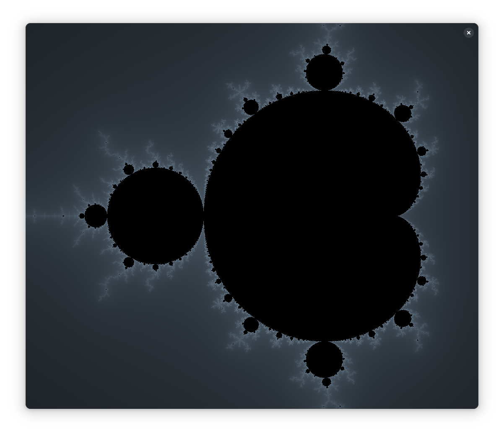
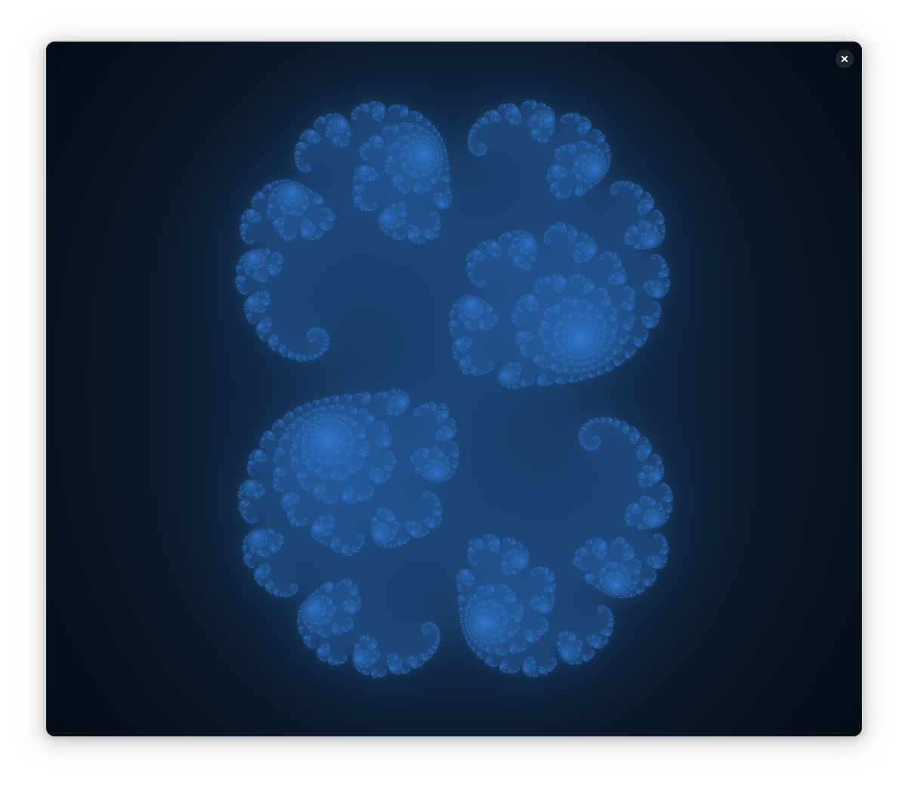
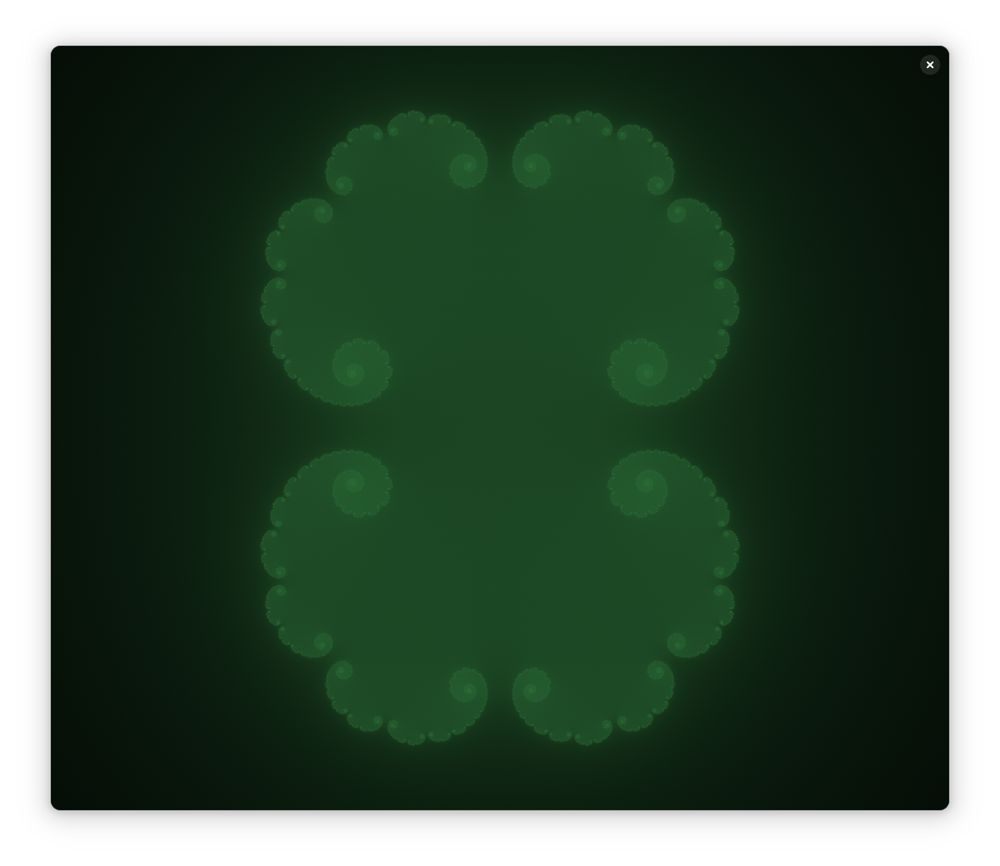

# FRACTAL

  

    <section style="flex: 0 0 100%; height: 100%; display: flex; justify-content: center; align-items: center; scroll-snap-align: start; scroll-snap-stop: always;">
      
    </section>
    <section style="flex: 0 0 100%; height: 100%; display: flex; justify-content: center; align-items: center; scroll-snap-align: start; scroll-snap-stop: always;">
      
    </section>
    <section style="flex: 0 0 100%; height: 100%; display: flex; justify-content: center; align-items: center; scroll-snap-align: start; scroll-snap-stop: always;">
      
    </section>
  

  

    &lt;
  

  

    &gt;
  

A libadwaita application that draws multiple Mandelbrot sets in a GLSL shader. The code needs to be rewritten, but the process of writing this application was fun